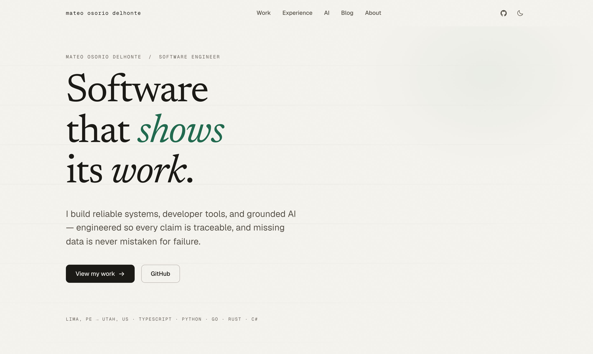

# mateo-portfolio

The personal portfolio of **Mateo Osorio Delhonte** — software engineer building reliable
systems, developer tools, and grounded AI.

**Live: [mateoosoriodelhonte.github.io/portfolio](https://mateoosoriodelhonte.github.io/portfolio/)**

[](https://github.com/mateoosoriodelhonte/portfolio/actions/workflows/ci.yml)
[](https://github.com/mateoosoriodelhonte/portfolio/actions/workflows/deploy.yml)



The site follows the same rule as the projects it presents: **every claim links to public
evidence.** Project facts come from the public repositories and the App Store listing, the
open-source PR state is verified against the GitHub API at build time, and the resume page is
generated from the same data as everything else.

## Stack

| Layer     | Choice                                                             |
| --------- | ------------------------------------------------------------------ |
| Framework | Astro 7, fully static output — zero client-side framework          |
| Language  | TypeScript (strict, `noUncheckedIndexedAccess`)                    |
| Styling   | Tailwind CSS 4 with a custom token system (see DESIGN_SYSTEM.md)   |
| Type      | Newsreader · Geist · Geist Mono, self-hosted via Astro's Fonts API |
| Content   | Astro Content Collections + MDX, dual-theme Shiki highlighting     |
| Motion    | Astro View Transitions + a ~150-line vanilla script (no libraries) |
| Testing   | Playwright (81 checks across desktop + mobile) with axe-core       |
| CI/CD     | GitHub Actions → GitHub Pages                                      |

Client-side JavaScript is deliberately minimal: theme persistence, the mobile menu, the
reveal-on-scroll observer, the work filter, and one scroll-linked diagram. Everything else is
static HTML and CSS.

## Architecture

```text
src/
  content.config.ts      content collections schema (blog)
  content/blog/          MDX articles (draft: true renders in dev only)
  layouts/
    BaseLayout.astro     head, fonts, theme bootstrap, nav, footer
    CaseStudyLayout.astro shared case-study shell (hero, facts, prev/next)
  components/            nav, footer, SEO, shared editorial pieces
  lib/
    site.ts              central config — every external link in one place
    projects.ts          verified project data consumed by all pages
    github.ts            build-time PR-state check with committed fallback
    blog.ts              collection helpers (published, reading time)
  pages/                 routes; each case study is a bespoke page
  scripts/app.ts         the one client script
  styles/global.css      the entire design system
scripts/
  og.mjs                 social-card generator (outputs committed)
  shots.mjs              visual-QA screenshot harness
tests/                   Playwright suite (runs against the production build)
```

More detail in [ARCHITECTURE.md](ARCHITECTURE.md); the visual system is documented in
[DESIGN_SYSTEM.md](DESIGN_SYSTEM.md).

## Local development

```bash
npm install
npm run dev        # http://localhost:4321/portfolio
```

The `/portfolio` base path matches the GitHub Pages deployment, so development and production
resolve URLs identically.

| Command               | Does                                          |
| --------------------- | --------------------------------------------- |
| `npm run dev`         | dev server                                    |
| `npm run build`       | production build to `dist/`                   |
| `npm run preview`     | serve the production build                    |
| `npm run check`       | Astro + TypeScript checks                     |
| `npm run format`      | Prettier                                      |
| `npm run test:e2e`    | Playwright suite (builds are served on :4322) |
| `node scripts/og.mjs` | regenerate social cards                       |

## Content workflow

Blog posts are MDX files in `src/content/blog/` with typed frontmatter:

```yaml
title: "Post title"
description: "One-sentence description used for meta and cards."
pubDate: 2026-08-16
category: "Engineering" # Engineering · AI / RAG · System Design · Developer Tools · Lessons Learned · Open Source
draft: false # true → visible in dev, excluded from builds
```

Internal links inside posts are written root-relative (`/work/reposignal/`) and rewritten to the
deploy base by an MDX component mapping. New posts get a social card by adding an entry to
`scripts/og.mjs` (the default card is the fallback).

## Testing

```bash
npm run test:e2e
```

81 checks across two browser projects (desktop Chromium, Pixel-class mobile): every route,
navigation and the mobile menu, theme switching and persistence, reduced-motion behavior,
horizontal-overflow guards, the work filter, blog/RSS behavior, internal-link resolution, and
axe WCAG 2.1 AA scans on ten representative pages. The suite runs against the built site, not
the dev server.

## Deployment

Pushes to `main` deploy to GitHub Pages via `.github/workflows/deploy.yml` (build → artifact →
deploy, no branch juggling). The build runs with the Actions token so the build-time PR-state
check has a normal rate limit; if GitHub is unreachable the committed fallback state is used and
the build proceeds.

### Moving to a custom domain later

1. Add the domain in the repository's Pages settings and create the DNS records GitHub shows.
2. Set `PUBLIC_SITE_URL=https://yourdomain.com` and `PUBLIC_BASE_PATH=""` for the build
   (environment variables read in `astro.config.mjs`).
3. Update `public/robots.txt` and `public/site.webmanifest`, which reference the current URL
   directly, and regenerate the social cards' footer line in `scripts/og.mjs`.

No other changes are required — internal links all resolve through the configured base.

## License

Code is MIT. The written content, project screenshots, and personal images are © Mateo Osorio
Delhonte.
